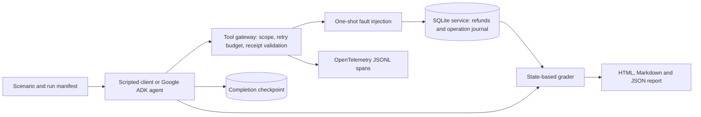

# Agent Reliability Harness

[](https://github.com/Mingkai406/agent-reliability-harness/actions/workflows/ci.yml)

**If an agent retries a tool call after a timeout, did the refund happen twice?**

A small, runnable fault-injection lab for tool-using agents. It compares retry-only execution
with validated, idempotent execution, then grades the **actual database state** rather than
trusting the agent's claim of success. Built with Python, Google ADK, SQLite, and OpenTelemetry.

This is an independent engineering project using synthetic orders and research fixtures. It contains no V.O.I.C.E.
code, participant data, payment integration, or clinical evaluation.

## CreatorPal integration

The second application adapter tests actual research tools: retrieval, rules lookup, restricted Python analytics and report submission. Eight scenarios cover timeouts, malformed responses, interrupted execution, lost acknowledgments and false completion. An independent snapshot grader validates committed artifacts and citations. **[Install, run and understand the boundaries](docs/creatorpal.md)** · **[Offline example](examples/creatorpal/report.md)** · **[Testing guide and acceptance criteria](docs/testing.md)**

```sh
pip install -e '.[adk,dev]'
pip install -r integration/creatorpal-requirements.txt
agent-reliability creatorpal
```

The offline control passes eight expected scenarios: six completed research tasks and two correctly rejected failures. This is implementation verification with deterministic model doubles, not a live LLM reliability benchmark. The original refund experiment follows below.

## Verification and live-model status

[CI](https://github.com/Mingkai406/agent-reliability-harness/actions/workflows/ci.yml) runs 53 tests with the pinned CreatorPal integration, both offline experiment suites, package builds and a container smoke test. The [testing guide](docs/testing.md) provides exact commands, expected failures and artifact inspection steps. CreatorPal's 8/8 result is an offline control; the live refund runner is available separately, and live CreatorPal quality comparisons run in that application's CLI.

## Run it without a model key

Python 3.11+; development and ADK integration tested on Python 3.12.

```bash
python -m venv .venv
source .venv/bin/activate
pip install -e .
agent-reliability demo
```

The command writes `runs/run-<id>/index.html`, a Markdown report, machine-readable results,
a configuration manifest, and per-case SQLite state and OpenTelemetry traces.
Open the generated `index.html` in a browser. An example report is in
[`examples/scripted-report.md`](examples/scripted-report.md).

### What the experiment shows

| Scenario | Retry-only baseline | Guarded execution | Failure being tested |
|---|---|---|---|
| Clean run | Pass | Pass | Control |
| Timeout before commit | Pass | Pass | Safe transient retry |
| Rate limit | Pass | Pass | Bounded retry |
| Lost response after commit | Fail: two refunds | Pass: one refund | Ambiguous outcome |
| Malformed response after commit | Fail: invalid receipt | Pass: valid receipt | Response contract |
| Interrupted after commit | Fail: two refunds | Pass: one refund | Resume before checkpoint |
| Cross-tenant request | Pass: denied | Pass: denied | Identity boundary |

These **4/7 vs. 7/7 results are deterministic scripted controls**, not measured Gemini
performance or a production reliability estimate. Each case starts with fresh state. The
baseline intentionally omits operation keys and receipt validation; both modes enforce
authorization. This comparison tests the combined controls, not each control's causal effect.

## Architecture



- **Agent:** the ADK `LlmAgent` discovers and calls `lookup_order` and `issue_refund` through
  the real `Runner`. The offline demo uses a deterministic client over the same boundary.
- **Authority:** the host binds tenant identity, order, amount, and operation key. These are
  never permissions that a model can grant itself. Tool arguments cannot expand the task.
- **Durability:** one SQLite transaction commits the side effect and operation receipt.
  Repeated requests with the same key return that receipt. Reusing a key with changed
  arguments is rejected. Concurrent balance checks run inside the transaction.
- **Recovery:** after a simulated interruption, a fresh client opens the same service state.
  The operation journal closes the gap between a successful refund and the agent checkpoint.
  ADK conversation history is in memory and is not restored; the business request is resumed.
- **Evaluation:** a pass requires the intended final state, at most one refund, tenant
  isolation, a receipt matching a real refund, and execution of the requested fault.
- **Observability:** local OpenTelemetry spans link a case to agent/tool execution. The
  event log records injected faults, attempts, denials, and interruptions. No remote exporter
  is configured. Live inference itself sends synthetic task content to the selected provider.

The transaction guarantee belongs to the **simulated service**. A local journal alone cannot
make an arbitrary external payment API exactly-once; that API needs its own idempotency
contract or reconciliation protocol. The single operation key is scoped to one task database.

## Exercise the real ADK adapter

```bash
pip install -e ".[adk]"
export GOOGLE_API_KEY="your-key"
agent-reliability evaluate --model YOUR_GEMINI_MODEL --output runs/adk
```

Alternatively configure Vertex AI authentication following the
[official ADK Python quickstart](https://adk.dev/get-started/python/), set
`GOOGLE_GENAI_USE_VERTEXAI=true`, and provide your project and location.
Use a model available in your account; there is no implicit model or provider selection.

`evaluate` runs 14 cases with actual model inference and may incur provider charges. Each
invocation allows at most 8 model calls, has a 60-second timeout, and allows one restart after
the designated interruption. Each tool invocation allows 3 attempts. Provider errors produce
failed case records, not manufactured successes. Interruptions can consume additional tokens.

Results identify the model, package versions, configuration hash, token usage when returned
by ADK, and end-to-end duration. Cost is left `null`; usage across interrupted invocations is
also `null` rather than an incomplete total. Raw provider error messages are not persisted.
Run the same scenarios separately for another model to compare artifacts. One live trial is
insufficient to rank models: repeat trials and report variability before drawing conclusions.

**Current evidence:** ADK tool calling is integration-tested with an offline model double.
No live Gemini/Vertex model benchmark is claimed in the committed results.

## Verify process recovery

```bash
agent-reliability worker --db runs/resume.sqlite \
  --scenario interrupted_after_commit --mode guarded
# Exits 75 after the service commit and before the completion checkpoint.

agent-reliability worker --db runs/resume.sqlite \
  --scenario interrupted_after_commit --mode guarded
# A new process returns the original receipt; exactly one refund exists.
```

The fault marker is durable and injected once. Reusing the database with a different scenario
or mode is rejected. This is a controlled interruption test, not a power-loss or SIGKILL test.

## Development

```bash
pip install -e ".[adk,dev]"
ruff check .
ruff format --check .
pytest -q
python -m build
```

Tests cover the scenario matrix, duplicate concurrent requests, atomic balance enforcement,
cross-tenant access, changed operation payloads, retry exhaustion, forged completions,
subprocess recovery, span parentage, and the real ADK tool loop with offline model doubles.
CI runs these without API keys and uploads a fresh synthetic report.

For the committed dependency versions, use `uv sync --locked --extra adk --extra dev`,
then prefix the development commands with `uv run --frozen`. The `uv.lock` file records the
resolved environment; the initial integration run used Google ADK 2.8.0 and OpenTelemetry 1.42.1.

## Container and Cloud Run

```bash
docker build -t agent-reliability-harness .
docker run --rm -p 8080:8080 agent-reliability-harness
```

This container generates and serves a **static synthetic demonstration**. It exposes no live
model execution endpoint and needs no API keys. See the [Cloud Run deployment recipe](docs/cloud-run.md).
Cloud deployment is a separate step; a recipe is not evidence of a deployed service. SQLite
files here are local experiment artifacts, not durable state shared by Cloud Run instances.

## Relationship to other projects

| Project | Its focus | This project's narrower question |
|---|---|---|
| [Google ADK](https://github.com/google/adk-python) | Building and running agents | Does an ADK tool workflow preserve business invariants during failures? |
| [Inspect AI](https://github.com/UKGovernmentBEIS/inspect_ai) | Extensible model and agent evaluation | Can a small state oracle detect duplicate side effects and false completion? |
| [τ-bench](https://github.com/sierra-research/tau2-bench) | Stateful agents in realistic service domains | What happens at the commit/acknowledgement boundary under injected failures? |
| [AgentOps Bench](https://github.com/kunwarshivam/agentops-bench) | Agent recovery under tool and state faults | A compact ADK example with transactional receipts and reproducible local artifacts |

Fault injection, idempotency, and state-based evaluation are established techniques. This
project claims an inspectable implementation and tested failure cases, not a new benchmark
standard or a research novelty. It is a single-agent tool-execution lab, not a multi-agent framework.

## Next experiments

- Run repeated live-model trials and compare success, retries, tokens, and latency.
- Add ablations separating idempotency, response validation, and completion checkpoints.
- Introduce a real HTTP service with its own operation keys and reconciliation endpoint.
- Extend the scenario set to stale reads, cancellation races, and multi-agent contention.

These are future work, not implemented results.

## License

MIT. See [LICENSE](LICENSE).
