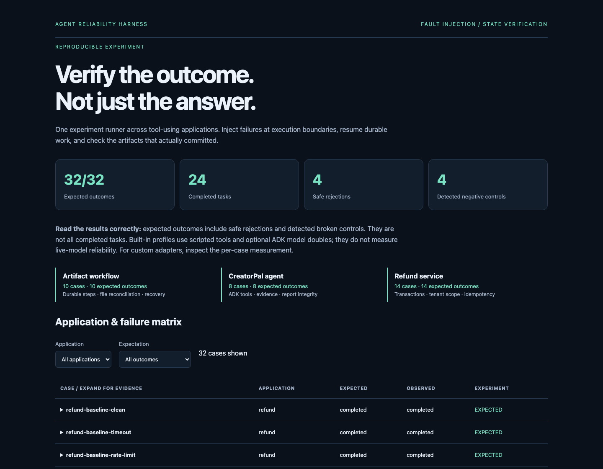
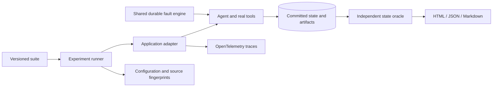

# Agent Reliability Harness

**Verify the outcome. Not just the answer.**

[](https://github.com/Mingkai406/agent-reliability-harness/actions/workflows/ci.yml)
[](pyproject.toml)
[](LICENSE)

A reusable fault-injection and state-verification framework for tool-using applications.
Test whether an agent's work **actually committed correctly** when a tool times out, a reply
is malformed, an acknowledgment disappears, or execution stops between steps.

**Python · Google ADK integration · SQLite · OpenTelemetry · Docker · GitHub Actions**

[Quickstart](#run-your-first-experiment) · [Results](examples/showcase/report.md) ·
[Bring your own agent](docs/adapters.md) · [Architecture](docs/architecture.md) ·
[Testing](docs/testing.md)



## What it does

- **Inject reproducible faults.** Configure tool, before/after boundary, failure kind, occurrence
  and repetition in JSON. A durable fault journal tracks injections across worker restarts.
- **Check the real result.** Application-specific oracles inspect database records, files,
  citations and receipts independently of an agent's success message.
- **Exercise recovery.** Test retries, idempotent writes, checkpoint recovery and the gap between
  a committed side effect and its acknowledgment. The application owns its recovery policy.
- **Keep the evidence.** Save configuration and source fingerprints, state snapshots,
  fault events, OpenTelemetry traces, JSON results and a filterable HTML report.
- **Connect another application.** Implement three adapter methods and register a local plugin.
  The runner and fault engine remain unchanged.

## Three applications, one experiment contract

| Application | Real execution boundary | Independently verified outcome |
|---|---|---|
| **Refund service** | Authorized writes to a transactional SQLite service | One refund, correct amount, tenant scope and a receipt matching committed state |
| **CreatorPal research agent** | Real ADK Runner, retrieval, rules lookup, restricted Python analytics and report submission | One committed report, valid evidence references, required sources, analysis and matching receipt |
| **Artifact workflow** | Retrieve records → build summary → commit artifact → export file | Correct aggregate, one database commit, matching file bytes and a durable checkpoint |

The refund baseline deliberately omits operation keys and response validation. CreatorPal
includes a model double that falsely claims completion. These negative controls test whether
the grader detects a specific failure; they are not successful tasks.

## Run your first experiment

Python 3.11+; development and ADK integration are tested with Python 3.12.
From a clone of this repository:

```sh
python -m venv .venv
source .venv/bin/activate
pip install -e .
agent-reliability run
```

Open the printed `runs/suite-<id>/index.html`. The **core profile runs 24 cases across the refund
and artifact applications**, without model credentials or optional application dependencies.
Filter by application or unexpected outcome; expand a case to inspect its invariant checks.

For all three applications, install the pinned CreatorPal integration:

```sh
pip install -e '.[adk]'
pip install -r integration/creatorpal-requirements.txt
agent-reliability run --profile full
```

This uses CreatorPal's real tools and ADK Runner with deterministic model doubles. It makes
**no live model calls**. Missing optional dependencies produce an error; they are not silently
counted as covered applications.

## Read the results correctly

The committed [full example](examples/showcase/report.md) contains:

| Application | Cases matching expectation | Completed tasks | Safe rejections | Detected negative controls |
|---|---:|---:|---:|---:|
| Refund service | 14/14 | 9 | 2 | 3 |
| Artifact workflow | 10/10 | 9 | 1 | 0 |
| CreatorPal | 8/8 | 6 | 1 | 1 |
| **Total** | **32/32** | **24** | **4** | **4** |

A case passes only when **its observed outcome matches its declared expectation and every
scheduled injection fires**. Negative controls must also fail exactly the named invariant
checks. An adapter exception or an unreached fault cannot pass as a detected negative control.

These are deterministic engineering controls, not a 100% model-reliability claim. Durations
measure local execution; model usage and cost remain unmeasured. See the
[manifest](examples/showcase/manifest.json) and [machine-readable results](examples/showcase/results.json).

## Configure the failure, preserve the oracle

Save this as `suite.json`:

```json
{
  "schema_version": 1,
  "cases": [{
    "id": "artifact-lost-ack",
    "adapter": "artifact",
    "faults": [{
      "tool": "commit_artifact",
      "phase": "after",
      "kind": "lost_ack",
      "occurrence": 1,
      "repeat": 1
    }],
    "expected": "completed"
  }]
}
```

```sh
agent-reliability run --suite suite.json
```

The artifact commits, its acknowledgment is lost, and the workflow retries. The grader then
requires one committed artifact and a matching exported file. Change the schedule without
changing the success criteria. See the complete [core](examples/suites/core.json) and
[full](examples/suites/full.json) configurations.

| Before a tool | After a tool |
|---|---|
| Timeout, rate limit, controlled interruption, permanent error | Lost acknowledgment, malformed response, controlled interruption |

Faults are injected at instrumented boundaries. A rate-limit case raises a synthetic retryable
failure; it does not emulate a provider's HTTP quota policy.

## Bring your own agent

The adapter separates application execution from independent assessment:

```python
class ApplicationAdapter:
    def validate(self, case): ...
    async def execute(self, case, directory, faults, tracer): ...
    def assess(self, case, execution): ...
```

An executable fourth example demonstrates external registration without editing the framework:

```sh
PYTHONPATH=examples agent-reliability run \
  --plugin kv=custom_adapter:create_adapter \
  --suite examples/suites/custom.json
```

It performs an actual idempotent SQLite write and retries a lost acknowledgment. Replace its
tool boundary and state oracle with your own. The [adapter guide](docs/adapters.md) explains
sync/async integration, error translation, configuration validation and negative controls.

## How execution becomes evidence



The harness measures controls; it does not supply a production workflow scheduler. SQLite
transactions provide the local service guarantees in these examples. A real external API needs
its own idempotency or reconciliation contract. The artifact application reconciles a file from
committed database content; it does not claim an atomic transaction across SQLite and a filesystem.

## Verify restart recovery

```sh
agent-reliability artifact-worker --directory runs/recovery
# Exits 75 after the database commit, before file export and completion checkpoint.

agent-reliability artifact-worker --directory runs/recovery
# A fresh process exports the committed content and returns the original artifact digest.
```

Tests also forcibly kill a child process between database commit and file export, then verify
recovery in another process. Further checks cover concurrent scheduling, corrupted snapshots,
retry exhaustion, missing injections, changed task bindings and external plugin execution.

## Development and deployment

```sh
uv sync --locked --extra adk --extra dev
uv pip install --python .venv/bin/python -r integration/creatorpal-requirements.txt
uv run --no-sync pytest -q
uv run --no-sync ruff check .
uv run --no-sync ruff format --check .
uv run --no-sync python -m build
```

CI runs the tests, the full 32-case profile, the original application suites, package builds and
an HTTP smoke test of the container. Generated run evidence is uploaded as a CI artifact.

```sh
docker build -t agent-reliability-harness .
docker run --rm -p 8080:8080 agent-reliability-harness
```

The container serves the **core report across two applications** at `http://localhost:8080`.
It exposes no model-execution API. The [Cloud Run recipe](docs/cloud-run.md) describes optional
hosting; no cloud deployment or large-scale distributed performance is claimed.

## Further reading

- [Architecture and guarantee boundaries](docs/architecture.md)
- [Adapter authoring and fault configuration](docs/adapters.md)
- [Tests, expected outcomes and live-model validation](docs/testing.md)
- [Refund baseline, guarded execution and optional live ADK runner](docs/refunds.md)
- [CreatorPal integration and snapshot contract](docs/creatorpal.md)

The original `demo`, `evaluate`, `worker`, `creatorpal` and `serve-demo` commands remain available.
Only `evaluate --model ...` deliberately runs live inference; model benchmarking is a separate
validation step. This repository uses synthetic fixtures and contains no V.O.I.C.E. participant
data or payment-provider integration.

MIT · [License](LICENSE)
