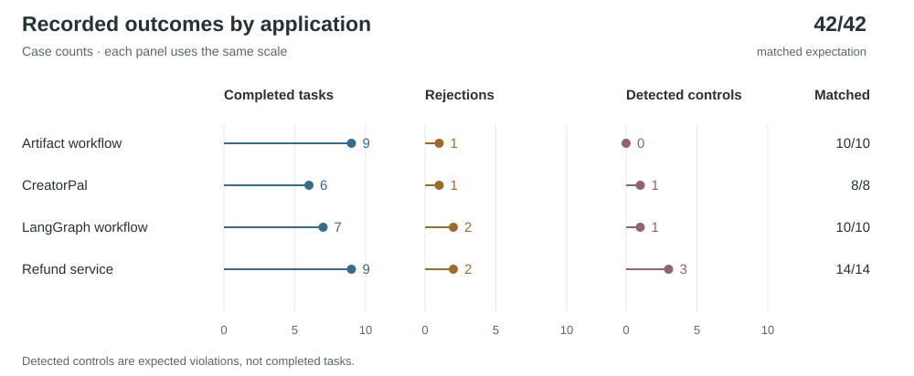
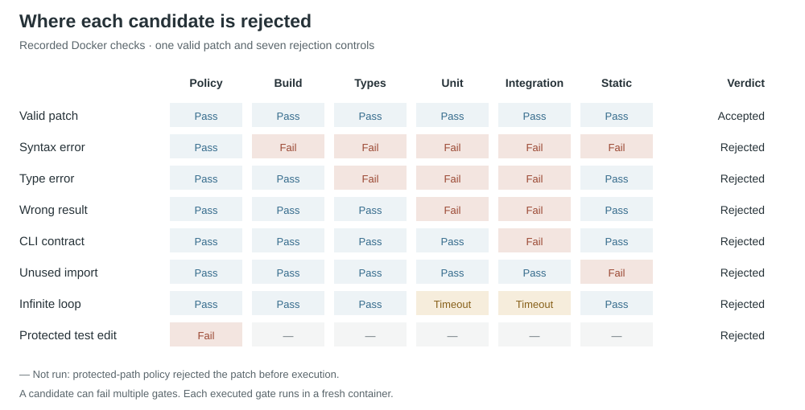

# Agent Reliability Harness

Test how agent applications recover from tool failures, and validate candidate code changes
against independent checks. Supports Google ADK, LangGraph and custom Python adapters.

[](https://github.com/Mingkai406/agent-reliability-harness/actions/workflows/ci.yml)
[](pyproject.toml)
[](LICENSE)

[Quickstart](#quickstart) · [Recorded results](#recorded-results) ·
[Code validation](#code-validation) · [Adapters](docs/adapters.md) · [Documentation](#documentation)

## Recorded results

The full example runs **42 deterministic cases across four applications**. The harness injects
faults at tool boundaries, resumes interrupted work and checks database state, files and
receipts. The plot separates completed tasks, safe rejections and detected broken controls.

[](examples/showcase/report.md)

**31 tasks completed, 6 were safely rejected, and 5 negative controls were detected.**
“42/42 matched” means every case produced its declared outcome and all scheduled faults fired.
These offline controls use deterministic workflows and model doubles; they do not estimate
live-model reliability.

[Case-by-case results](examples/showcase/report.md) ·
[Results JSON](examples/showcase/results.json) · [Run manifest](examples/showcase/manifest.json)

<details>
<summary>View the counts as a table</summary>

| Application | Completed | Rejected | Detected controls | Matched expectation |
|:---|---:|---:|---:|---:|
| Refund service | 9 | 2 | 3 | 14/14 |
| Artifact workflow | 9 | 1 | 0 | 10/10 |
| CreatorPal | 6 | 1 | 1 | 8/8 |
| LangGraph | 7 | 2 | 1 | 10/10 |
| **Total** | **31** | **6** | **5** | **42/42** |

</details>

## Quickstart

Python 3.11+; development and ADK integration are tested with Python 3.12.
From a clone of this repository:

```sh
python -m venv .venv
source .venv/bin/activate
pip install -e .
agent-reliability run
```

Open the printed `runs/suite-<id>/index.html`. The default profile runs **24 refund and artifact
cases** without model credentials. The report includes an outcome plot, searchable case table,
invariant checks and links to the evidence retained for each case.

| To run | Install | Command |
|:---|:---|:---|
| Core controls · 24 cases | Base package above | `agent-reliability run` |
| LangGraph · 10 cases | `pip install -e '.[langgraph]'` | `agent-reliability run --profile langgraph` |
| Full example · 42 cases | Both framework extras and CreatorPal, below | `agent-reliability run --profile full` |

```sh
pip install -e '.[adk,langgraph]'
pip install -r integration/creatorpal-requirements.txt
agent-reliability run --profile full
```

The full profile uses real ADK tools and a real LangGraph workflow with deterministic model
doubles and nodes. No live model calls are made. Missing optional dependencies produce errors.

## Code validation

Apply a candidate diff to a committed repository snapshot. A protected-path policy runs first;
build, type, unit, integration and static checks then run in **five fresh Docker containers**.
Each verdict retains exit codes, hashes and logs.

[](examples/code-validation/report.md)

The matrix is generated from the committed snapshots, including failures in multiple gates.
The protected-test candidate is rejected before execution; its empty cells are not passes.

[Run the showcase](docs/code-validation.md#run-the-showcase) ·
[Inspect results](examples/code-validation/report.md) ·
[Integrate a repository](docs/code-validation.md#integrate-your-repository)

## Integrations

| Application | Execution boundary | Independent checks |
|:---|:---|:---|
| [Code validation](docs/code-validation.md) | Candidate diff and isolated Docker gates | Protected paths, all gate results, complete evidence |
| [HTTP charge service](docs/http-transport.md) | Separate HTTP process, lost connections, concurrent retries | One effect, amount binding, conflict rejection, receipt-to-ledger match |
| [Refund service](docs/refunds.md) | Transactional SQLite writes | One refund, correct amount, tenant scope, matching receipt |
| [CreatorPal](docs/creatorpal.md) | ADK Runner, retrieval, analytics, report submission | One report, valid citations, required sources, matching receipt |
| [LangGraph](docs/langgraph.md) | StateGraph, node retries, disk-backed checkpoints | Resume behavior, one artifact, matching file and receipt |
| [Artifact workflow](docs/architecture.md) | Retrieval, summary, commit, file export | Correct aggregate, one commit, file bytes, durable checkpoint |

The refund baseline omits operation keys and response validation. CreatorPal includes a model
double that falsely claims completion. These controls verify that the grader detects specific
failures. An adapter exception or an unreached fault cannot pass as a detected negative control.

[Incident triage](docs/incident-triage.md) uses HTTP receipts, service events and durable state
to diagnose failures, with cited evidence, explicit abstention and an optional rules-gated model adapter.

## Configure a failure

Save the following as `suite.json`. This case loses the acknowledgment after an artifact
commits, then checks that recovery leaves one artifact and a matching exported file.

```json
{
  "schema_version": 1,
  "cases": [{
    "id": "artifact-lost-ack",
    "adapter": "artifact",
    "faults": [{
      "tool": "commit_artifact",
      "phase": "after",
      "kind": "lost_ack",
      "occurrence": 1,
      "repeat": 1
    }],
    "expected": "completed"
  }]
}
```

```sh
agent-reliability run --suite suite.json
```

| Boundary | Available faults |
|:---|:---|
| Before a tool | Timeout, rate limit, controlled interruption, permanent error |
| After a tool | Lost acknowledgment, malformed response, controlled interruption |

The durable fault journal tracks injections across restarts. Rate-limit faults are synthetic
retryable failures; they do not emulate a provider's quota policy.
[Suite configuration and adapters →](docs/adapters.md)

## Recovery and custom adapters

To test LangGraph recovery across two processes:

```sh
agent-reliability langgraph-worker --directory runs/graph-recovery
# Exits 75 after the commit, before the node result is checkpointed.
agent-reliability langgraph-worker --directory runs/graph-recovery
# Resumes with one committed artifact and a matching exported file.
```

Use `artifact-worker` in place of `langgraph-worker` for the built-in artifact application.
Tests also forcibly kill a worker in the commit/checkpoint gap and verify recovery in a fresh
process. [LangGraph guide](docs/langgraph.md) · [Test coverage](docs/testing.md)

To integrate another application, implement the adapter's three methods:

```python
class ApplicationAdapter:
    def validate(self, case): ...
    async def execute(self, case, directory, faults, tracer): ...
    def assess(self, case, execution): ...
```

The [external adapter example](examples/custom_adapter.py) performs an idempotent SQLite write
and retries a lost acknowledgment:

```sh
PYTHONPATH=examples agent-reliability run \
  --plugin kv=custom_adapter:create_adapter \
  --suite examples/suites/custom.json
```

The application owns its retry and reconciliation policy. The harness owns fault injection
and independent assessment. See [architecture and guarantee boundaries](docs/architecture.md).

## Development

```sh
uv sync --locked --extra adk --extra langgraph --extra dev
uv pip install --python .venv/bin/python -r integration/creatorpal-requirements.txt
uv run --no-sync pytest -q
uv run --no-sync ruff check .
uv run --no-sync ruff format --check .
uv run --no-sync python -m build
```

CI runs tests, experiment profiles, Docker code-validation checks, package builds and a
container smoke test. Run evidence is uploaded as a CI artifact.

```sh
docker build -t agent-reliability-harness .
docker run --rm -p 8080:8080 agent-reliability-harness
```

The container serves the core report at `http://localhost:8080`.
[Optional Cloud Run hosting](docs/cloud-run.md)

## Documentation

| Topic | Guide |
|:---|:---|
| Execution, state verification and guarantee boundaries | [Architecture](docs/architecture.md) |
| Plugins, fault schedules and independent assessment | [Adapter authoring](docs/adapters.md) |
| Expected outcomes and live-model validation | [Testing](docs/testing.md) |
| HTTP transport controls and failure diagnosis | [HTTP controls](docs/http-transport.md) · [Incident triage](docs/incident-triage.md) |
| Reproduce the figures and report layout | [Report presentation](docs/report-presentation.md) |

The original `demo`, `evaluate`, `worker`, `creatorpal` and `serve-demo` commands remain available.
Only `evaluate --model ...` deliberately runs live inference. Fixtures are synthetic and contain
no V.O.I.C.E. participant data or payment-provider integration.

[MIT License](LICENSE)
