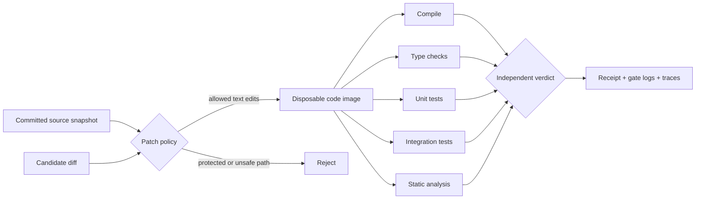

# Code validation adapter

Evaluate candidate patches with a trusted repository snapshot, protected checks and
five independent Docker executions. The existing suite runner records source hashes,
gate results, receipts, OpenTelemetry spans and a browsable HTML report.



## Run the showcase

```sh
pip install -e .
docker build -f Dockerfile.validator -t harness-code-validator:local .
python -m agent_reliability.code_demo --output runs/code-validation
```

The demo creates an evaluator-owned Python repository and eight candidate patches:

| Candidate | Expected outcome | Intended detection |
|---|---|---|
| Correct arithmetic fix | Accepted | All five checks pass |
| Invalid syntax | Rejected | Compilation |
| Wrong return type | Rejected | mypy strict checking |
| Wrong arithmetic | Rejected | Unit regression |
| CLI-specific regression | Rejected | JSON CLI integration contract |
| Unused import | Rejected | Ruff static analysis |
| Infinite loop | Rejected | Execution timeout |
| Test-file modification | Rejected | Protected-path policy, before execution |

Negative examples are rejected candidates, not successfully completed coding tasks.
The demo asserts that each intended gate actually catches its corresponding defect.
Missing Docker, missing images and container setup failures are errors, never passes.

## Integrate your repository

Configure the adapter in trusted local Python, then pass it to `run_matrix` or register
a factory with `--plugin code-validation=your_module:factory`:

```python
from pathlib import Path
from agent_reliability.code_validation import CodeValidationAdapter


def factory():
    return CodeValidationAdapter(
        repository=Path("/path/to/trusted/repository"),
        patches={"candidate-1": Path("/path/to/candidate.diff").read_text()},
        checks={
            "build": ["python", "-c", "import src.application"],
            "types": ["mypy", "--cache-dir", "/tmp/mypy", "src"],
            "unit": ["python", "-m", "unittest", "tests.test_unit"],
            "integration": ["python", "-m", "unittest", "tests.test_integration"],
            "static": ["ruff", "check", "--no-cache", "src"],
        },
        image="your-prebuilt-validator:local",
        allowed=("src/",),
        timeout=10,
    )
```

Your image must include the project dependencies, required tools and `/workspace`.
Five nonempty command lists are mandatory. The example commands must be adapted to
real tests for the target repository. Only trusted factories define commands, paths,
images and timeouts; a candidate diff cannot change those settings.

## Execution boundary

The host reads committed regular Git blobs and applies an ordinary text diff. Only
existing files under configured source prefixes may change. Renames, mode changes,
symlinks, submodules, binary patches and additions/deletions are outside this version's
contract. Keep tests, policies and CI outside allowed prefixes. Ignored and untracked
files, Git metadata and local credentials are not copied.

A stopped staging container receives the source; it never executes candidate code.
The resulting disposable image supplies a fresh container for every gate. Containers
run as a non-root user with networking disabled, a read-only root filesystem, dropped
capabilities, no host mounts, no Docker socket, and CPU, memory, PID and time limits.
The writable scratch area is `/tmp`. Containers and the temporary image are removed
after execution, including failures and timeouts.

This is a local developer validation tool using Docker's isolation boundary. Tests are
evaluator-owned, but an adversarial program can still attempt to exploit its runtime or
test framework. Treat it as regression validation for candidate changes, not a formal
proof of correctness or a hostile multi-tenant execution service. No model inference is
required, so patches may come from an AI coding tool or a human author.

## Reproducibility

[Recorded showcase](../examples/code-validation/report.md) ·
[Adapter](../src/agent_reliability/code_validation.py) ·
[Regression tests](../tests/test_code_validation.py)

The snapshot records the base commit, patch SHA-256, resolved validator image ID,
bounded stdout/stderr, exit codes and timeout status. Each check emits an OpenTelemetry
span. The eight code cases are separate from the existing 42 application-reliability
scenarios; those remain a distinct experiment.
